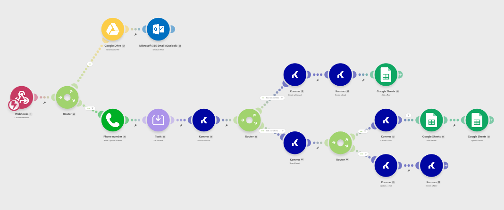
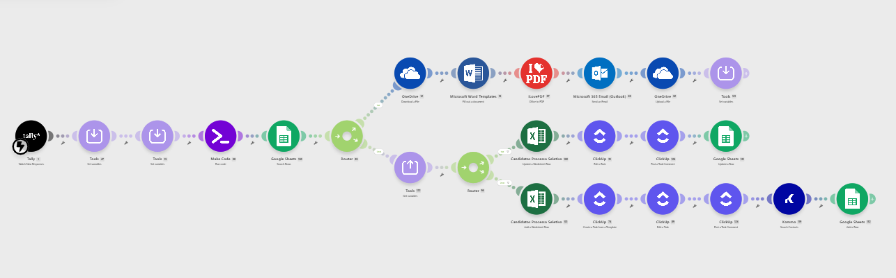
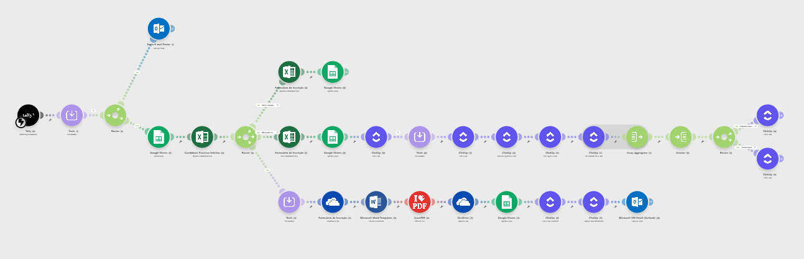
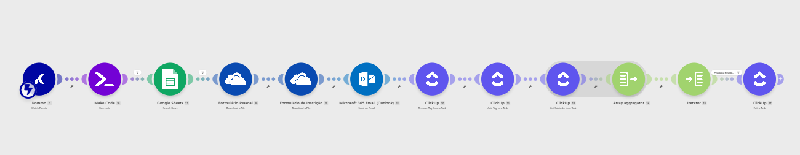
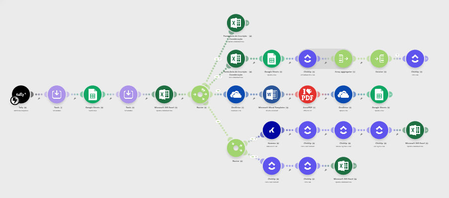
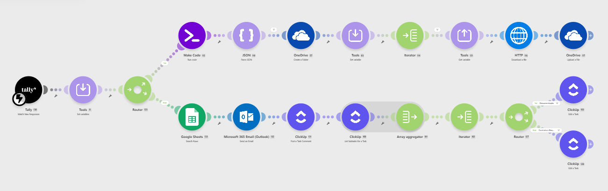
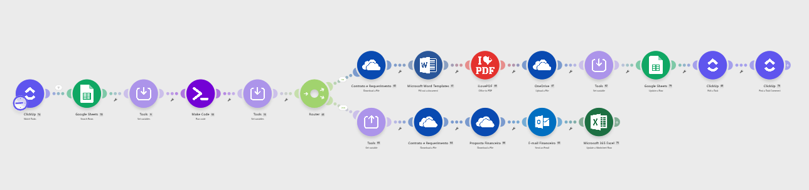

# 🎓 Automação do Processo Seletivo — UniMissional

<div align="center">

[](https://make.com)
[](https://sheets.google.com)
[](https://microsoft.com/365)
[](https://clickup.com)
[](https://developer.mozilla.org/en-US/docs/Web/JavaScript)

**Autor:** [André Scultori](https://github.com/amscultori)
[](https://www.linkedin.com/in/andrescultori)

**Período:** Março 2025 — Setembro 2026

🇺🇸 [Read in English](README.en.md)

</div>

---

## Visão Geral

Sistema completo de automação do processo seletivo da **UniMissional**, instituição brasileira de ensino que oferece formação missional integrada a cursos universitários, com moradia e alimentação. O projeto automatizou **13 cenários sequenciais** — do primeiro contato do candidato até a confirmação de matrícula — eliminando tarefas manuais repetitivas, reduzindo erros operacionais e melhorando a experiência do candidato em cada etapa.

## Problema

Antes da automação, o processo seletivo era inteiramente manual:
- Dados de candidatos registrados em planilhas por colaboradores
- Documentos gerados manualmente um a um
- Comunicações enviadas individualmente para cada candidato
- Nenhuma rastreabilidade centralizada do pipeline de candidatos
- Alto risco de erros humanos e perda de informações

## Solução

Ecossistema de automação integrado conectando 10+ ferramentas via APIs e webhooks, cobrindo 100% do processo seletivo de forma automatizada.

## Resultados

- ✅ **100%** do processo seletivo automatizado — do primeiro contato ao check-in
- ✅ **~80%** de redução no consumo de operações após otimizações arquiteturais
- ✅ **Zero intervenção manual** em geração de documentos, comunicações e registros
- ✅ Rastreabilidade completa do candidato em múltiplos sistemas simultaneamente
- ✅ Experiência do candidato significativamente melhorada com comunicações personalizadas

---

## 🛠️ Stack Tecnológica

| Categoria | Ferramenta | Uso |
|---|---|---|
| **Automação** | Make.com | Orquestração central de todos os fluxos |
| **Formulários** | Tally.so | Coleta de dados em todas as etapas |
| **CRM** | Kommo | Gestão de leads e comunicação via WhatsApp |
| **Gestão de Tarefas** | ClickUp | Acompanhamento por candidato |
| **Planilhas** | Microsoft Excel | Registro histórico e relatórios PowerBI |
| **Banco de Dados** | Google Sheets | Camada de lookup rápido |
| **Armazenamento** | Microsoft OneDrive | Documentos e arquivos gerados |
| **Documentos** | DOCX Templater | Geração de documentos Word a partir de templates |
| **Conversão** | iLovePDF | Conversão DOCX → PDF |
| **E-mail** | Microsoft Outlook 365 | Comunicações automáticas |
| **E-assinatura** | ZapSign | Previsto para implementação futura |

### Linguagens e Tecnologias

- **JavaScript** — Lógica customizada nos módulos Make.com: manipulação de arrays, extração de campos aninhados de APIs, conversão de valores para extenso em pt-BR, tratamento de URLs e parsing de dados
- **RegEx** — Extração de dados via Text Parser do Make.com
- **JSON** — Comunicação com APIs REST (Kommo, ClickUp, Microsoft Graph)
- **Fórmulas Google Sheets** — Cálculo de métricas e formatação de dados

---

## 🔄 Arquitetura dos Cenários

```
┌─────────────────────────────────────────────────────────────────┐
│                    PROCESSO SELETIVO UNIMISSIONAL                │
├─────────────────────────────────────────────────────────────────┤
│                                                                   │
│  [01] Formulário de Interesse ──► Kommo + E-mail + Google Sheets │
│           │                                                       │
│  [02] Proposta Financeira ──────► Excel + ClickUp + PDF + E-mail │
│           │                                                       │
│  [03] Formulário de Inscrição ──► Excel + GSheets + PDF + E-mail │
│           │                                                       │
│  [04] Formulário Pessoal ───────► Excel + GSheets + PDF + E-mail │
│           │                                                       │
│  [05] Formulário Pastoral ──────► Excel + GSheets + PDF + E-mail │
│           │                                                       │
│  [06] Agendar Entrevista ───────► E-mail Mentor                  │
│           │                                                       │
│  [07] Parecer da Entrevista ────► ClickUp + Kommo + PDF          │
│           │                                                       │
│  [08] Envio de Documentos ──────► OneDrive + ClickUp             │
│           │                                                       │
│  [09] Registro RA + Declaração ─► Excel + GSheets + PDF          │
│           │                                                       │
│  [10] Emissão de Contrato ──────► PDF + OneDrive + E-mail        │
│           │                                                       │
│  [11] Pagamento Confirmado ─────► Excel + ClickUp                │
│           │                                                       │
│  [12] Check-in ─────────────────► Excel + ClickUp                │
│           │                                                       │
│  [13] Desistência do Candidato ─► ClickUp + Excel                │
│                                                                   │
└─────────────────────────────────────────────────────────────────┘
```

### Fluxo de Dados

```
Tally / Kommo / ClickUp (Triggers)
         │
         ▼
    Make.com (Orquestração)
         │
    ┌────┴──────────────────────────────┐
    │                                   │
    ▼                                   ▼
Google Sheets                    Microsoft Excel
(Lookup / Validação)             (Registro histórico)
    │                                   │
    └──────────────┬────────────────────┘
                   │
           ┌───────┴────────┐
           │                │
           ▼                ▼
      OneDrive           ClickUp
      (Documentos)       (Tarefas)
           │
           ▼
    DOCX Templater → iLovePDF → PDF Final
```

---

## 📸 Screenshots

### Cenário 01 — Formulário de Interesse


### Cenário 02 — Envio da Proposta Financeira


### Cenário 03 — Formulário de Inscrição


### Cenário 06 — Parecer da Entrevista


### Cenário 07 — Envio de Documentos


### Cenário 08 — Registro RA + Declaração


### Cenário 10 — Pagamento Confirmado


---

## 📋 Descrição dos Cenários

### 01 — Formulário de Interesse
**Trigger:** Webhook do site institucional

Verifica duplicatas no Kommo por telefone. Se novo candidato: cria contato e lead. Se existente: cria novo lead vinculado ao contato. Envia e-mail personalizado com eBook da UniMissional.

**Destaques:** Formatação automática de telefone brasileiro com nono dígito · Deduplicação de contatos no Kommo · Registro no Google Sheets com Contact ID e Lead ID

---

### 02 — Envio da Proposta Financeira
**Trigger:** Tally (equipe interna)

Gera proposta financeira personalizada em PDF via DOCX Templater + iLovePDF. Cria tarefa no ClickUp com subtarefas para acompanhamento. Registra no Excel e Google Sheets. Busca dupla (e-mail + nome) para evitar registros duplicados quando a equipe usa e-mails diferentes para o mesmo candidato.

**Destaques:** JavaScript para conversão de valores monetários para extenso em pt-BR · Set/Get Variable através de Aggregators · Vinculação automática ao CRM

---

### 03 — Formulário de Inscrição
**Trigger:** Tally (candidato)

Processa dados pessoais, familiares e de emergência. Envia e-mail automático ao pastor com link do formulário pastoral pré-preenchido. Gera PDF do formulário e envia ao candidato para conferência. Distingue entre primeiro preenchimento e repreenchimento.

**Destaques:** Roteamento por `Formulario_Row_ID` · Subtarefas do ClickUp via Feeder único com filtro por nome · E-mail automático ao pastor

---

### 04 — Formulário Pessoal
**Trigger:** Tally (candidato)

Registra informações confidenciais do candidato em planilha restrita à coordenação e mentor. Gera PDF e envia ao candidato para conferência. Salva File ID no Google Sheets para uso posterior no cenário de Agendar Entrevista.

**Destaques:** Planilha separada com acesso restrito · File ID preservado para uso em cenários posteriores

---

### 05 — Formulário Pastoral
**Trigger:** Tally (pastor)

Processa formulário do pastor de referência. Grava em planilha restrita à coordenação. Gera PDF e arquiva no OneDrive. Envia e-mail de agradecimento ao pastor usando e-mail sincronizado do Google Sheets.

**Destaques:** Busca por CPF normalizado (somente números) · E-mail de agradecimento ao pastor via campo sincronizado

---

### 06 — Agendar Entrevista
**Trigger:** Webhook Kommo (campo customizado "Agendar Entrevista" = true)

JavaScript extrai campo customizado aninhado do array do Kommo. Envia ao mentor os PDFs do Formulário de Inscrição e Formulário Pessoal por e-mail, para preparação da entrevista. Inclui link do WhatsApp do candidato pré-configurado e link do formulário de parecer pré-preenchido.

**Destaques:** Padrão JavaScript para extração de campos aninhados do Kommo · Busca por `Kommo_Lead_ID` no Google Sheets

---

### 07 — Parecer da Entrevista
**Trigger:** Tally (mentor)

Router condicional por resultado: aprovado move o lead no Kommo via API PATCH para o bucket correto, ativando o bot com próximos passos ao candidato; reprovado posta comentário urgente no ClickUp notificando a equipe. Gera PDF do parecer e arquiva no OneDrive.

**Destaques:** API Kommo via `Make an API Call` com PATCH · Endpoint `/v4/leads` sem prefixo `/api`

---

### 08 — Envio de Documentos
**Trigger:** Tally (candidato)

Recebe até 9 documentos (RG, CPF, CNH, Certidão de Casamento etc.). JavaScript monta array dinâmico filtrando apenas URLs válidas com `accessToken`. Iterator substitui 9 rotas fixas paralelas. Cria pasta personalizada no OneDrive e organiza arquivos por tipo de documento.

**Destaques:** Iterator dinâmico — 18 módulos reduzidos para 4 · Tratamento de múltiplos arquivos por campo · Validação de `accessToken` na URL do Tally

---

### 09 — Registro do RA e Declaração de Convênio
**Trigger:** Webhook Kommo (campo customizado "RA" preenchido)

JavaScript extrai o RA do lead pelo `field_id`. Grava no Excel e Google Sheets. Paralelamente, gera a Declaração de Convênio em PDF com o RA e dados do candidato, faz upload no OneDrive e registra o File ID. Atualiza subtarefa no ClickUp.

**Destaques:** Número serial para datas no Excel eliminando ambiguidade regional · `round(parseNumber(timestamp) / 86400 + 25569; 0)` · 3 rotas paralelas independentes

---

### 10 — Emissão de Contrato
**Trigger:** ClickUp Watch Tasks Polling (subtarefa "Contrato e Requerimento" em progresso)

Busca todos os dados do candidato no Google Sheets por `ClickUp_Task_ID` direto — eliminando os módulos Get Task e Text Parser com regex que existiam anteriormente. Gera contrato em PDF via DOCX Templater + iLovePDF. Envia ao financeiro por e-mail com contrato e proposta financeira em anexo.

**Destaques:** JavaScript unificado convertendo valor monetário e percentual de desconto para extenso em pt-BR · Set/Get Variable preservando File ID entre rotas paralelas

---

### 11 — Pagamento Confirmado
**Trigger:** ClickUp Watch Tasks Polling (subtarefa de pagamento em progresso)

Quando o financeiro confirma o pagamento da primeira mensalidade, atualiza o Excel com status "Matriculado", marca a subtarefa como concluída no ClickUp, posta comentário com data e realiza troca de tags para rastreabilidade no pipeline.

**Destaques:** Busca por `ClickUp_Task_ID` via `{{2.parent}}` · Troca de tags para rastreabilidade de pipeline

---

### 12 — Check-in
**Trigger:** Webhook Kommo (campo customizado de check-in = true)

Quando o aluno chega fisicamente à UniMissional e confirma pelo bot do Kommo, registra o check-in na planilha de alunos (separada da do processo seletivo), atualiza a subtarefa no ClickUp com comentário e data, e realiza troca de tags.

**Destaques:** Aggregator com campo `status` incluído eliminando módulo `getATask` desnecessário · Filtro por status diretamente no Feeder

---

### 13 — Desistência do Candidato
**Trigger:** Webhook Kommo (mudança de status do lead)

Quando o status do lead no Kommo é movido para o bucket de desistência, o cenário registra automaticamente a desistência: posta comentário na task do ClickUp com a data, adiciona tag "desistente", marca a task como concluída e atualiza o Excel com o status "Desistente" e observação com a data.

**Destaques:** Trigger via status do Kommo · Registro automático da data de desistência em todos os sistemas

---

## ⚙️ Otimizações Arquiteturais

### Arquitetura de Dados

```
ANTES:
Excel listWorksheetRows → N operações por execução

DEPOIS:
Google Sheets Search Rows → 1 operação por execução

Redução: ~80% nas operações Make.com
```

### Padrões Estabelecidos

**1. Set/Get Variable através de Aggregators**
```
Set Variable (antes do Iterator)
     │
Iterator → processa N bundles
     │
Get Variable (após o Iterator — preserva o valor)
```

**2. JavaScript para campos aninhados do Kommo**
```javascript
const fields = Array.isArray(input.fields) ? input.fields : [input.fields];
const field = fields.find(f =>
  f !== null && f !== undefined &&
  String(f.id) === String(input.field_id)
);
const value = field?.values?.[0]?.value ?? null;
```

**3. Número serial para datas no Excel**
```javascript
// Elimina ambiguidade de formato regional (DD/MM vs MM/DD)
round(parseNumber(formatDate(date; "X")) / 86400 + 25569; 0)
```

**4. Iterator dinâmico substituindo rotas fixas**
```
ANTES: 9 rotas fixas = 18 módulos
DEPOIS: JavaScript + Iterator = 4 módulos
```

**5. fieldsById em módulos Tally**
```
{{fieldsById.question_XXXXX}}  ✅  // Robusto a renomeações
{{fields.`Nome do Campo`}}     ❌  // Quebra se renomear
```

---

## 📁 Estrutura do Repositório

```
automacao-processoseletivo/
│
├── README.md                          # Este arquivo (Português)
├── README.en.md                       # English version
│
├── docs/
│   ├── architecture.md                # Arquitetura detalhada
│   ├── optimizations.md               # Log de otimizações
│   └── images/
│       ├── cenario01screenshot.png
│       ├── cenario02screenshot.png
│       ├── cenario03screenshot.png
│       ├── cenario06screenshot.png
│       ├── cenario07screenshot.png
│       ├── cenario08screenshot.png
│       └── cenario10screenshot.png
│
├── scripts/
│   ├── kommo-extract-custom-field.js
│   ├── number-to-words-ptbr.js
│   ├── dynamic-url-array.js
│   ├── excel-date-serial.js
│   └── tally-dropdown-update.js
│
├── schemas/
│   └── google-sheets-candidatos.md
│
└── blueprints/
    └── README.md
```

---

## 🔒 Segurança e Privacidade

Os blueprints neste repositório foram sanitizados — todos os dados sensíveis foram removidos:

- ❌ IDs de contas e workbooks
- ❌ Tokens de API
- ❌ IDs de pastas e arquivos no OneDrive
- ❌ IDs de listas e tarefas do ClickUp
- ❌ IDs de formulários Tally
- ❌ Dados de candidatos

Para utilizar os blueprints, substitua os valores marcados com `YOUR_*` pelas suas credenciais.

---

## 📄 Licença

Este projeto é privado e desenvolvido exclusivamente para a UniMissional.
O código e a arquitetura são compartilhados para fins de portfólio.

---

<div align="center">

Desenvolvido por **[André Scultori](https://github.com/amscultori)**

[](https://www.linkedin.com/in/andrescultori)
[](https://github.com/amscultori)

</div>
